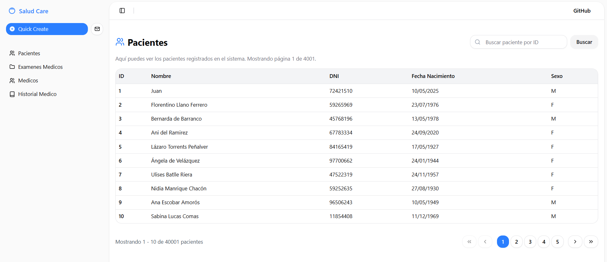
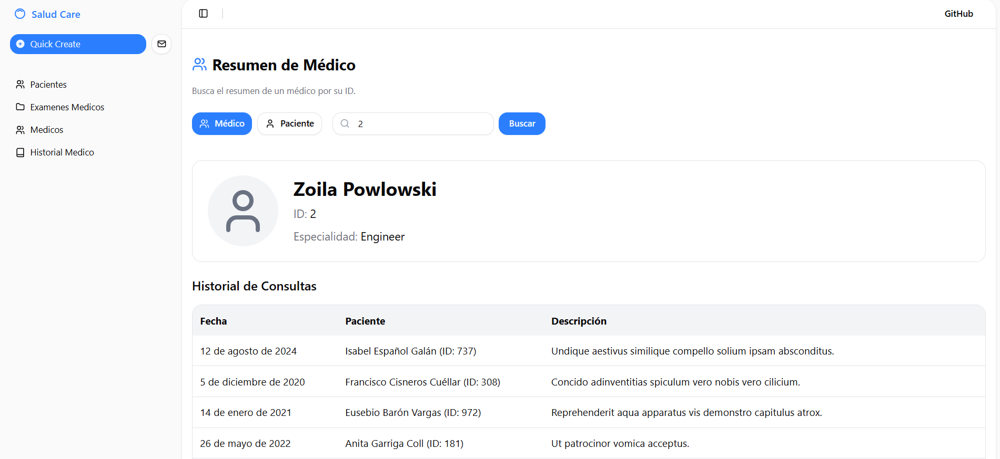
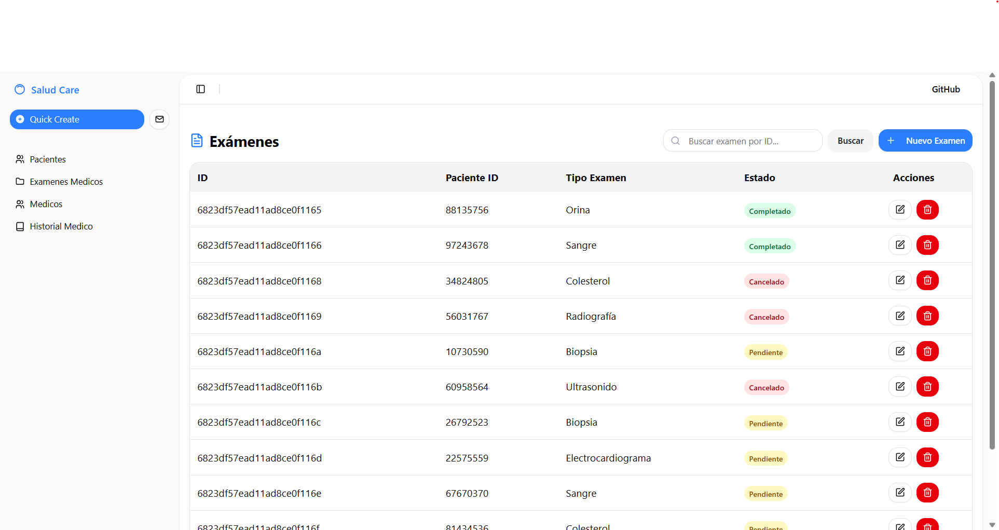

# SaludCare - Plataforma Médica Basada en Microservicios

## Descripción del Proyecto

SaludCare es una plataforma innovadora para la digitalización de servicios médicos, desarrollada como parte de mi portafolio de proyectos. Implementa una arquitectura moderna basada en microservicios que permite gestionar consultas médicas, exámenes de laboratorio y la relación con los pacientes de manera eficiente.

## Características Principales

- **Arquitectura de Microservicios**: Sistema distribuido con componentes independientes que facilitan el mantenimiento y la escalabilidad.
- **Tecnologías Multi-lenguaje**: Implementación de servicios en Node.js, Python y Java, demostrando versatilidad técnica.
- **Bases de Datos Heterogéneas**: PostgreSQL, MySQL y MongoDB para optimizar el almacenamiento según las necesidades de cada servicio.
- **Despliegue en AWS**: Utilización de servicios cloud de AWS para garantizar alta disponibilidad y escalabilidad.
- **Frontend Moderno**: Interfaz de usuario desarrollada con Next.js para una experiencia fluida y responsiva.
- **Análisis de Datos**: Implementación de AWS Athena para consultas analíticas sobre los datos operacionales.

## Arquitectura del Sistema

### Microservicios Implementados

1. **Microservicio de Consultas Médicas (Node.js + PostgreSQL)**
   - Gestión de citas médicas, asignación de pacientes y médicos
   - API REST para interacción con otros servicios

2. **Microservicio de Pacientes (Python + MySQL)**
   - Gestión de información personal y contacto de pacientes
   - Historial médico y relación con consultas y exámenes

3. **Microservicio de Exámenes Médicos (Java + MongoDB)**
   - Administración de exámenes y resultados
   - Almacenamiento flexible para diferentes tipos de exámenes

4. **Microservicio Orquestador (Python)**
   - Coordinación entre los demás microservicios
   - Gestión centralizada de solicitudes

### Infraestructura Cloud

- **Load Balancer**: Balanceador de carga para distribución eficiente de tráfico
- **S3 Buckets**: Almacenamiento de datos históricos y archivos
- **AWS Glue**: Catalogación de datos para análisis
- **AWS Athena**: Consultas SQL sobre datos almacenados en S3
- **EC2 Instances**: Despliegue de microservicios en contenedores Docker

## Tecnologías Utilizadas

- **Backend**: Node.js, Python, Java
- **Frontend**: Next.js, React
- **Contenedorización**: Docker, Docker Compose
- **Bases de Datos**: PostgreSQL, MySQL, MongoDB
- **Cloud**: AWS (EC2, S3, Glue, Athena, ELB)
- **Documentación API**: Swagger
- **Control de Versiones**: Git, GitHub

## Demo y Acceso

- **Web Frontend**: [http://proyectocloud01.s3-website-us-east-1.amazonaws.com](http://proyectocloud01.s3-website-us-east-1.amazonaws.com)
- **API Swagger Docs**:
  - Consultas Médicas: [http://p1-77815598.us-east-1.elb.amazonaws.com:3000/api](http://p1-77815598.us-east-1.elb.amazonaws.com:3000/api)
  - Pacientes: [http://p1-77815598.us-east-1.elb.amazonaws.com:5000/apidocs/](http://p1-77815598.us-east-1.elb.amazonaws.com:5000/apidocs/)
  - Orquestador: [http://p1-77815598.us-east-1.elb.amazonaws.com:5002/apidocs/](http://p1-77815598.us-east-1.elb.amazonaws.com:5002/apidocs/)

## Repositorios de Código

- [https://github.com/DarKNeSsJuaN25/ingesta-consultas](https://github.com/DarKNeSsJuaN25/ingesta-consultas)
- [https://github.com/DarKNeSsJuaN25/ingesta-p1](https://github.com/DarKNeSsJuaN25/ingesta-p1)
- [https://github.com/DarKNeSsJuaN25/proyecto](https://github.com/DarKNeSsJuaN25/proyecto)

## Logros y Aprendizajes

- Implementación exitosa de arquitectura de microservicios con tecnologías heterogéneas
- Desarrollo de sistema de orquestación para coordinar servicios independientes
- Utilización de bases de datos específicas para cada tipo de servicio (SQL y NoSQL)
- Configuración de infraestructura cloud en AWS con alta disponibilidad
- Estrategias de recopilación y análisis de datos para inteligencia de negocio

## Contacto

¿Interesado en saber más sobre este proyecto o mis habilidades? ¡Contáctame!

- **Email**: adrian.auqui@utec.edu.pe
- **LinkedIn**: [AdrianAuquiPerez](https://www.linkedin.com/in/adrian-antonio-auqui-perez-a079b2291/)
- **GitHub**: [Auky216](https://github.com/Auky216)

## Imágenes de Referencia

### Pacientes

### Resumen Medico

### Examenes

---

*Este proyecto fue desarrollado como parte de mi portafolio para demostrar mis habilidades en arquitectura de microservicios, desarrollo full-stack y soluciones cloud.*